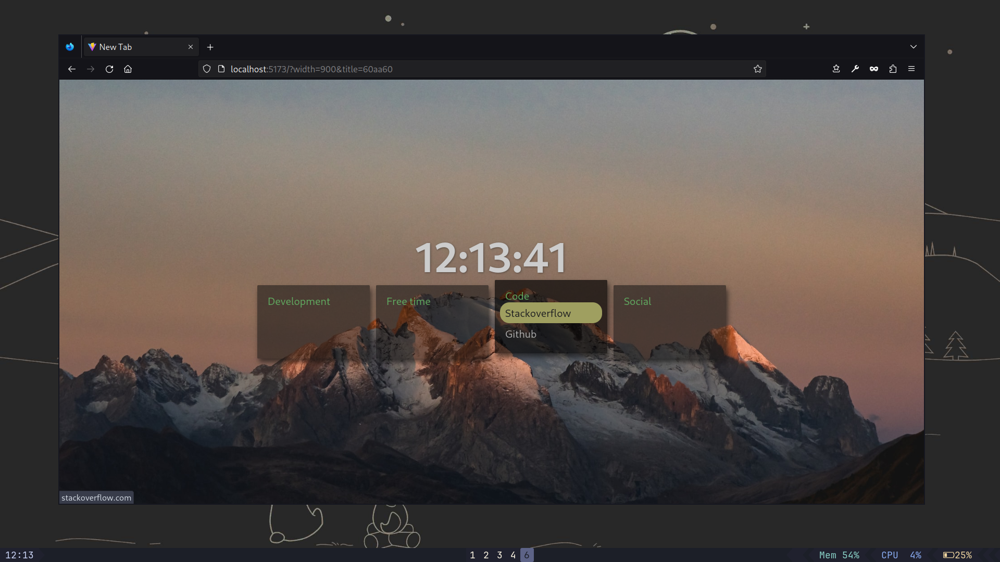

# BlobStart [2.0.0]
- 🌲 Finally some simple and refreshing startpage

- *noticed some of the shortcuts are hidden? they're actually there and you just need to hover them*

# Customizing
- Append config params to the url `?param=value`
- You can use `?bg=COLOR`, `?title=COLOR`, `?width=PIXELS`
- - *Whereas `COLOR` beeing simple hex code without `#`, like `141419` or `242e2a`*

# Custmizing links & images
- fork this repo
- edit `config.json` inside `docs` folder